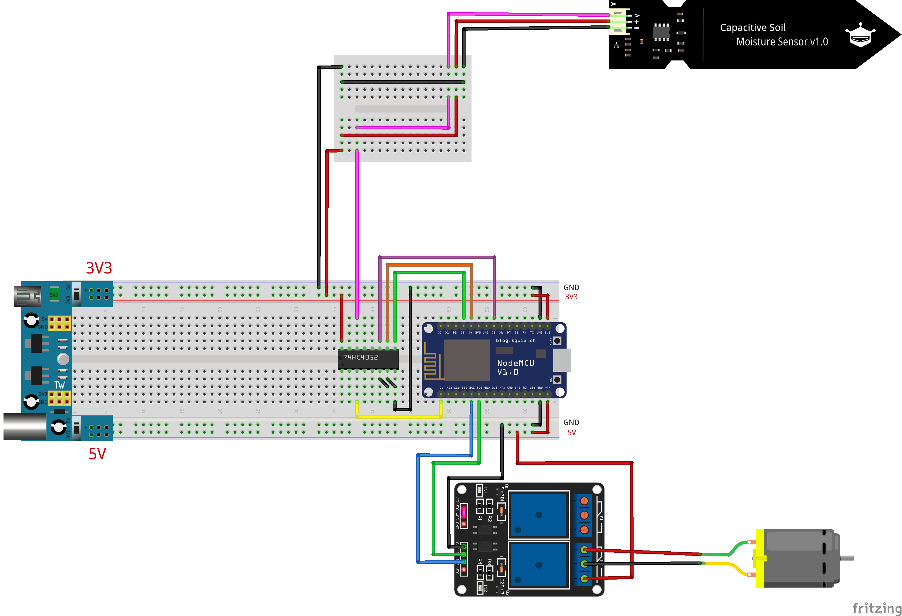
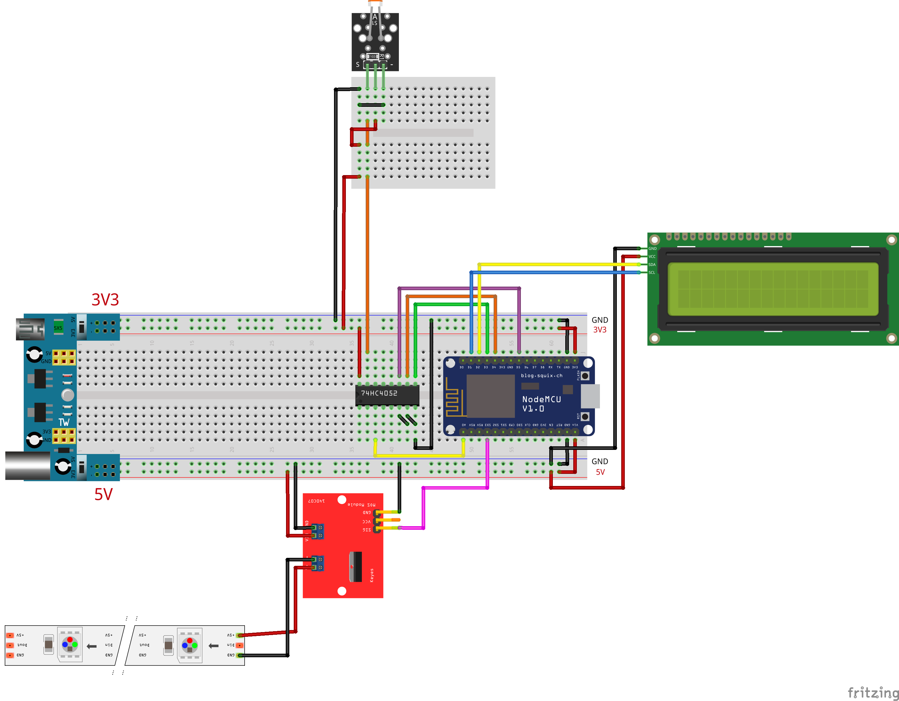
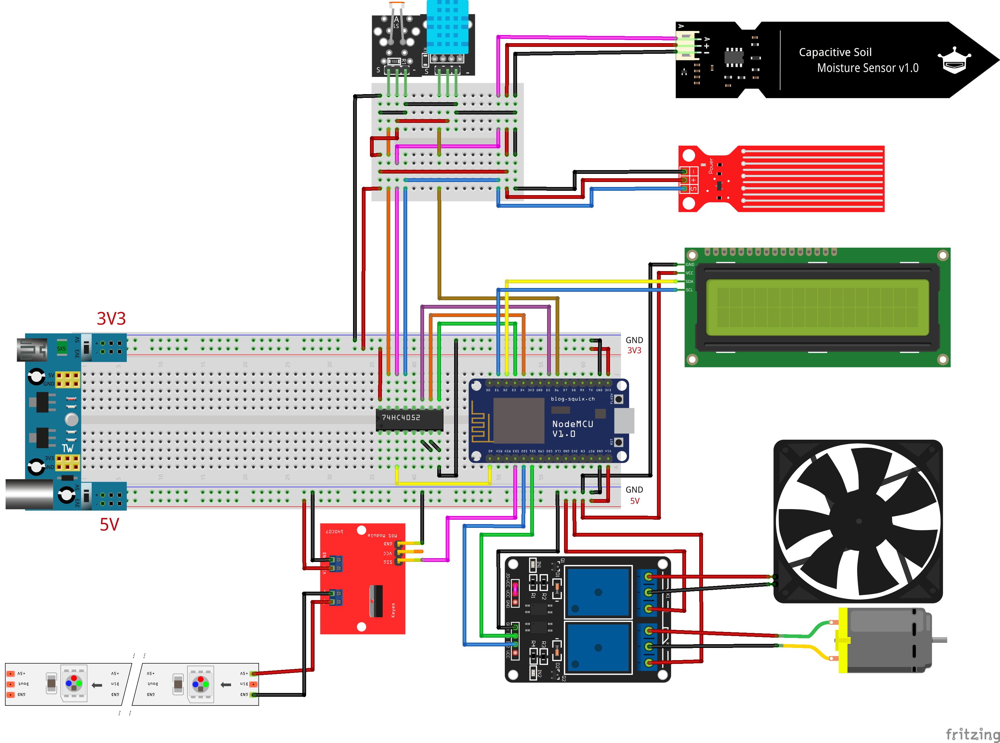

# POWARxFabschools
POWAR at Fabschools

## BOM
*ESP-12 version at Fablab Benfica*

- Node-MCU ESP12 dev board;
- 3 sets of Jumper Wires - MM, MF, FF;
- 1 breadboard Power Adaptor;
- 1 Breadboard;
- 1 mini-breadboard;
- [1 Water-Pump + Tubing](https://www.amazon.es/-/pt/gp/product/B08BZBN29C/ref=ppx_od_dt_b_asin_title_s00?ie=UTF8&psc=1);
- [1 Fan]()
- [1 Temp and Humid Sensor](https://www.amazon.es/-/pt/gp/product/B07TSF94KD/ref=ppx_od_dt_b_asin_title_s00?ie=UTF8&psc=1)
- [1 LCD]()
- [1 LCD breakout]()
- [1 Mosfet Module]()
- [1 Light Sensor]()
- [1 2x relay module]()
- [1 water sensor]()
- [1 Moisture Sensro](https://www.amazon.es/-/pt/gp/product/B07V6M5C4H/ref=ppx_od_dt_b_asin_title_s00?ie=UTF8&psc=1)
- [1 grow Led Strip]()
- [1 Powar Source]() - *unavailable*

## Code

- Arduino Code for each sensor;
  - [LED_Blink](ArduinoCode/NEW CODES/SENSORS/01 POWAR-LED_Blink/POWAR-LED_Blink/POWAR-LED_Blink.ino)
  - [LDRwMAP](ArduinoCode/NEW CODES/SENSORS/02 POWAR-LDRwMAP)
- Arduino Code that adds all sensors together and prints their values on Serial Port;

- Arduino Code for Lesson 1;

- Arduino Code for Lesson 2;
- Arduino Code for Lesson 3;

- Arduino Code that connects prev version through MQTT to a Node-RED server through a wifi connection.

## Schematics

1. **lesson 1** Thirsty Plant:

Make a water pump to automatically water your plants when they are thirsty.

Connect a Capacitive Moisture Sensor and a water pump to your ESP and automatize the watering process.

2. **lesson 2** Automatic lights:

Make your LED lights react according to the light sensor.

Create a project in which lights will be activated when it is too dark, and it will also show in the LCD screen te percentage of luminosity in the room.

3. **lesson 3** Global weather vs global communication:

Connect to the internet and get weather information from elsewhere in your POWAR box.

## Node-RED POWAR server guide

... write the instructions to configure your own node-red sensor
